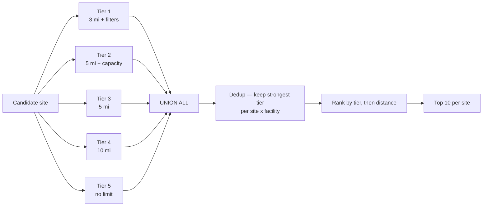

# Multi-Tier Competitor Discovery for Site Selection

A single-query **waterfall search** in PostgreSQL + PostGIS that guarantees every candidate site gets a competitor set — without pretending a distant match is a close one.

```
One radius fails everywhere. Five radii fail nowhere.
```

---

## The problem

Competitive analysis for site selection usually starts with a fixed buffer: *"find every competitor within 3 miles."*

That query breaks in both directions:

| Market type | 3-mile buffer returns | Result |
|---|---|---|
| Dense metro | 40+ competitors | Noise. The analyst hand-trims it. |
| Suburban | 6–10 competitors | Works as intended. |
| Rural / exurban | 0 competitors | **Empty row.** The site silently drops out of the analysis. |

Widening the radius to fix the rural case floods the metro case. Running it twice and merging by hand does not scale past a handful of sites, and it loses the information that mattered most: *how hard did we have to look?*

## The approach

Instead of one radius, define **five tiers** ordered from strictest to loosest. Every tier runs for every site. The results are stacked, deduplicated, and ranked.

| Tier | Radius | Attribute filters | Meaning |
|:---:|---|---|---|
| **1** | 3 mi | capacity ≥ 100 **and** median HH income ≥ $80k | Direct, comparable competitor in a qualified trade area |
| **2** | 5 mi | capacity ≥ 75 | Meaningful competitor, slightly further out |
| **3** | 5 mi | — | Any competitor in the local market |
| **4** | 10 mi | — | Regional context for a sparse market |
| **5** | ∞ | — | Nearest anything. Proof that we looked. |



### Why the tier number is the point

Every output row carries the tier it qualified under. A tier 1 match and a tier 5 match are both "a competitor," but they are **not the same quality of evidence** — and the person reading the output can see the difference without re-running anything.

That single column turns a flat list into a self-describing dataset. It also gives you a free diagnostic:

```sql
SELECT tier, COUNT(DISTINCT site_id) AS sites
FROM site_selection.candidate_site_competitors
GROUP BY tier ORDER BY tier;
```

If most sites bottom out at tier 4 or 5, your tier 1 thresholds are too strict for the portfolio. The query tells you how to tune itself.

---

## Usage

**Requires:** PostgreSQL 12+ with PostGIS 3.x. No other extensions.

```bash
psql -d your_db -v brand_name="'Acme Brand'" -f Multi_Tier_Analysis_public.sql
```

Then read the results:

```sql
SELECT * FROM site_selection.candidate_site_competitors
ORDER BY site_id, competitor_rank;
```

### Expected input schema

The query assumes two tables. Column names are illustrative — rename to match yours.

```sql
CREATE TABLE site_selection.candidate_sites (
    site_id       integer PRIMARY KEY,
    site_address  text,
    geom          geometry(Point, 4326)
);

CREATE TABLE poi.competitor_facilities (
    facility_id               integer PRIMARY KEY,
    facility_name             text,
    operator_brand            text,        -- NULL-safe; used to exclude our own sites
    address_line              text,
    city                      text,
    state_code                char(2),
    postal_code               text,
    permitted_capacity        integer,     -- the "size" attribute filter
    website_url               text,
    price_infant_full_day     numeric,
    waitlist_infant_flag      boolean,
    price_preschool_full_day  numeric,
    waitlist_preschool_flag   boolean,
    median_hh_income          integer,     -- trade-area demographic, e.g. ACS
    price_observed_date       date,
    geom                      geometry(Point, 4326)
);

CREATE INDEX ON site_selection.candidate_sites  USING GIST (geom);
CREATE INDEX ON poi.competitor_facilities       USING GIST (geom);
```

### Adapting it to your domain

Nothing here is specific to early-education centres. The tier structure is the reusable part:

- **`permitted_capacity`** → any size proxy: square footage, seat count, pump count, SKU depth.
- **`median_hh_income`** → any trade-area demographic gate.
- **Radii** → your own distance decay. Retail pharmacy uses tighter rings than a furniture showroom.
- **Number of tiers** → three is often enough. Add tiers where your markets are genuinely heterogeneous.

---

## Techniques worth stealing

**`ST_DWithin` filters, `ST_Distance` measures.**
`ST_DWithin` is the index-accelerated predicate — it hits the GiST index and eliminates almost everything. `ST_Distance` then runs only on the pairs that survived. Reversing this (`WHERE ST_Distance(...) < x`) forces a sequential scan over every pair.

**`IS DISTINCT FROM` instead of `!= 'x' OR ... IS NULL`.**
NULL-safe inequality in one operator. A facility with an unknown operator is correctly kept in the competitor set.

**Deduplicate with a window, not `DISTINCT ON` gymnastics.**
`ROW_NUMBER() OVER (PARTITION BY site_id, facility_id ORDER BY tier, distance_miles)` keeps the *strongest* tier each competitor qualified under. Without this, a nearby competitor appears five times.

**Replace the unbounded tier with `LATERAL` + KNN.**
Tier 5 as written is a cartesian product — fine for hundreds of sites, painful for tens of thousands. The indexed nearest-neighbour rewrite is included in the script:

```sql
CROSS JOIN LATERAL (
    SELECT f.* FROM poi.competitor_facilities f
    WHERE f.operator_brand IS DISTINCT FROM :brand_name
    ORDER BY f.geom <-> s.geom
    LIMIT 10
) n
```

The `<->` operator walks the GiST index outward from each site and stops at 10, instead of scoring every pair.

---

## Known trade-offs

**Projection choice.** The script projects to **EPSG:2163** (US National Atlas Equal Area) for planar maths. That is an equal-**area** projection, not an equidistant one, so distances carry a few percent of error across CONUS. Acceptable for *ranking*; not ideal for a mileage figure you hand to a client. For reported distances use `ST_Distance(s.geom::geography, f.geom::geography)` or a local state-plane / UTM zone. EPSG:2163 is also deprecated in favour of **EPSG:9311**.

**Per-row reprojection.** `ST_Transform` inside the join predicate is evaluated per row. On a large table, add a pre-projected geometry column with its own GiST index and drop the transforms entirely.

**Euclidean, not drive-time.** Straight-line distance is a proxy for accessibility. Where a river, a highway, or a rail corridor splits a trade area, straight-line ranking will overstate competition. An isochrone-based tier is the natural next step.

---

## Repository contents

| File | Purpose |
|---|---|
| `Multi_Tier_Analysis_public.sql` | The full query, commented, with the KNN rewrite and result-inspection queries |
| `README.md` | This file |

---

## License

MIT. Use it, change it, ship it.

---

*Built entirely on open-source geospatial tooling — PostgreSQL and PostGIS, no proprietary dependencies. If you adapt the tier structure to a different industry, I would genuinely like to hear how you set the thresholds.*
